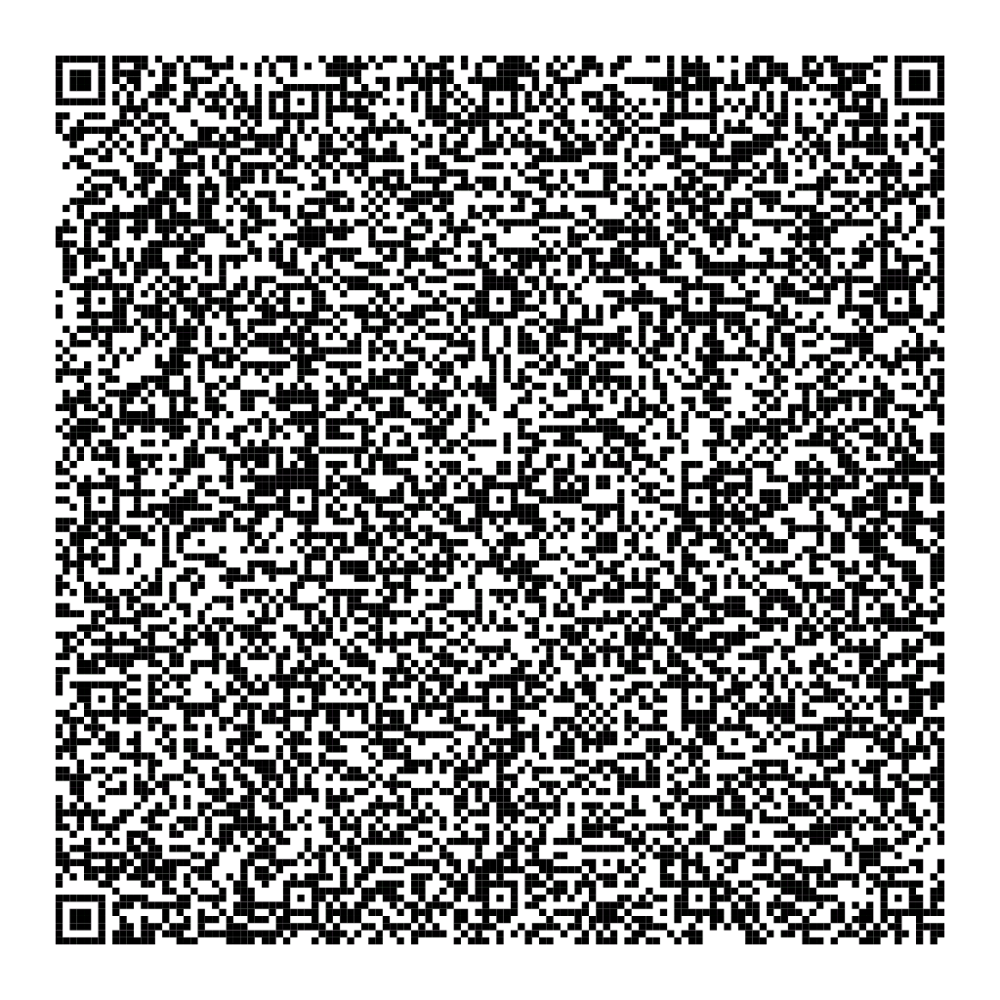

# QR-Game-Of-Life
This is a version of Conway's Game Of Life fully contained inside of a single QR-Code.

It requires no internet connection or special app to run, just your phone and any standard browser. The entire simulation (HTML, CSS, and JS) lives inside a data:text/html,... URI small enough to fit in a scannable QR code.

## How it works
 
The QR code encodes a `data:` URI, which lets a browser render a complete HTML page from a URL string alone, with no network request. Scanning the code and opening the link in a browser runs the simulation entirely offline.

## Files

- **[gameoflife.code](gameoflife.code)** - the minified, percent-encoded single-line `data:` URI. This is the exact string that gets encoded into the QR code.
- **[gameoflife-readable.html](gameoflife-readable.html)** - a readable, commented version of the same logic, for reference only. Not meant to be encoded. It's just documentation.

## Controls

- **Tap/click a cell** - toggle it alive/dead (works whether the simulation is running or paused)
- **`-` / `+` buttons, or Arrow Down / Arrow Up** - slow down / speed up the simulation
- **`||` button, or Spacebar** - pause / resume

Keyboard shortcuts only work on desktop browsers (mobile has no physical keyboard to fire `keydown` events), so the on-screen buttons are the primary controls on phones.

## QR-Code

## Usage

1. Generate a QR code from the contents of the `data:` URI file or use the QR-Code above.
2. Scan it with your phone's camera (I noticed that the built-in Scanner of iPhones fails to detect the content of the QR-Code. Use a third party QR-Code Scanner App, an Android phone or paste the contents of the [gameoflife.code](gameoflife.code) file into your browser instead)
3. Since most scanners won't auto-open `data:` links, copy the decoded text and paste it into your browser's address bar.
4. The simulation opens and runs entirely offline without a server or internet connection needed.

If you only want to see what it looks like you can use this hosted [link](https://verbrannter-toast.github.io/QR-Game-Of-Life/gameoflife-readable.html)

## Additional info incase you want to edit this

A few gotchas discovered along the way:

- **Most QR scanner apps won't auto-open `data:` links.** They hand off the decoded text to the system browser via a "content-initiated navigation," and browsers deliberately block that for `data:` URLs (it's a long-standing anti-phishing measure). You'll usually need to copy the decoded text and paste it into the address bar manually. Pasting directly into the address bar is allowed by design.
- **Unescaped `#` breaks everything.** Any raw `#` (e.g. in a hex color like `#0f0`) is parsed as a URL fragment separator. Everything after it gets silently dropped from the actual page content. All colors here are percent-encoded (`%23...`) to avoid this.
- **Other reserved/special characters are percent-encoded too** (`"` → `%22`, `<`/`>` → `%3C`/`%3E`, `%` → `%25`) as insurance against clipboard tools or keyboards mangling raw characters (e.g. straight quotes auto-converted to curly quotes) during the scan → copy → paste round trip.
